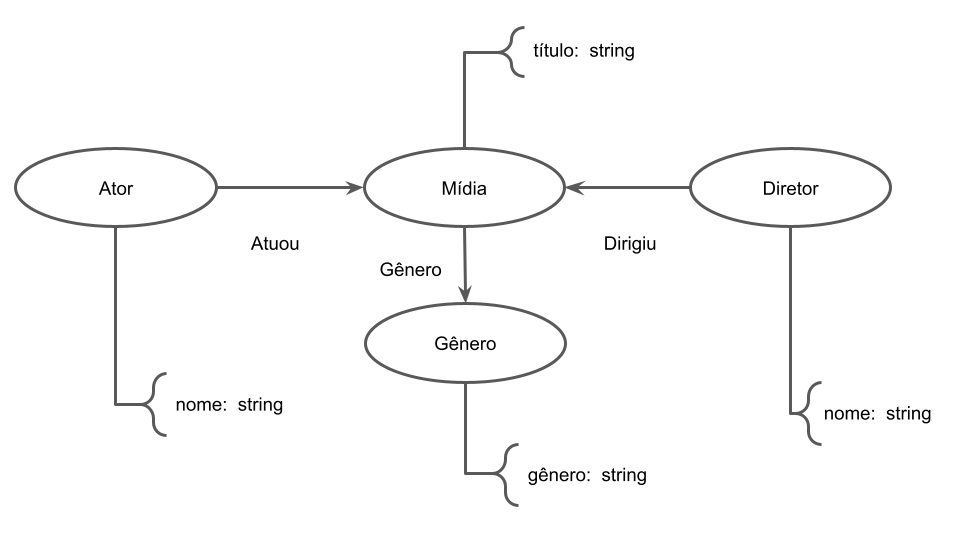
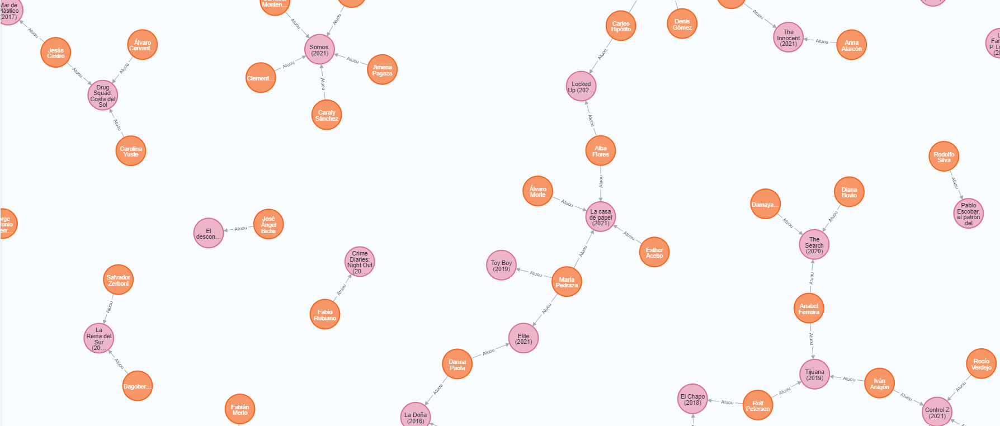

# Projeto `MC536-Chill`

# Equipe `MC536 & Chill` - `Chill`
* `André Vila Nova Wagner da Costa` - `213081`
* `Cristiano Sampaio Pinheiro` - `256352`
* `George Gigilas Junior` - `216741`

## Resumo do Projeto
> O acesso a filmes e séries foi muito facilitado com a popularização dos serviços de streaming. No entanto, o aumento no número dessas plataformas pode trazer dúvidas sobre quantas e quais assinar. Por isso, o grupo se propôs a avaliar o conteúdo disponível em quatro das principais plataformas de streaming: Netflix, Amazon Prime Video, Hulu e Disney Plus.

> Com isso, pode-se responder a perguntas como quais filmes possuem as melhores (ou piores) avaliações, quanto tempo uma obra demora para ser lançada em uma dessas plataformas, entre outras. No entanto, devido a uma maior disponibilidade de dados sobre o conteúdo da Netflix e da Disney+, o projeto apresentará uma maior quantidade de informações sobre estas plataformas.

## Slides da Apresentação
> [Slides](slides/previa.pdf)

## Modelo Conceitual

> 

## Modelos Lógicos

> Modelo lógico relacional
~~~
Filmes(_titulo_, _data de lançamento_, enredo, duração, plataforma,  classificação indicativa, avaliação IMDb, Rotten Tomatoes)
Séries(_título_, _data de lançamento_, enredo, temporadas, duração, plataforma, classificação indicativa, avaliação IMDb, Rotten Tomatoes)

Atores(_título_, _data de lançamento_,  _ator_)
Diretores(_título_, _data de lançamento_, _diretor_)

Gênero(_título_, _data de lançamento_, _gênero_)
País(_título_, _data de lançamento_, _país_)

Netflix(_título_, _data de lançamento_,  data de lançamento na plataforma)
Disney Plus(_título_, _data de lançamento_, data de lançamento na plataforma)
~~~

> Modelo de grafos de propriedades


## Dataset Publicado

título do arquivo/base | link | breve descrição
----- | ----- | -----
`Filmes` | [Link](data/processed/filmes.csv) | `Arquivo contendo dados sobre filmes`
`Séries` | [Link](data/processed/series.csv) | `Arquivo contendo dados sobre séries`
`Netflix` | [Link](data/processed/netflix.csv) | `Arquivo contendo data de lançamento para filmes e séries da Netflix`
`DisneyPlus` | [Link](data/processed/disneyplus.csv) | `Arquivo contendo data de lançamento para filmes e séries da Disney+`
`Atores` | [Link](data/processed/atores.csv) | `Arquivo contendo atores e filmes/séries em que trabalharam`
`Diretores` | [Link](data/processed/diretores.csv) | `Arquivo contendo diretores e filmes em que trabalharam`
`Criadores` | [Link](data/processed/criadores.csv) | `Arquivo contendo criadores e séries em que trabalharam`
`Gêneros` | [Link](data/processed/generos.csv) | `Arquivo contendo filmes/séries e seus respectivos gêneros`
`Países` | [Link](data/processed/paises.csv) | `Arquivo contendo filmes/séries e seus respectivos países de produção`

## Bases de Dados

título da base | link | breve descrição
----- | ----- | -----
`TV shows on Netflix, Prime Video, Hulu and Disney+` | [Link](https://www.kaggle.com/ruchi798/tv-shows-on-netflix-prime-video-hulu-and-disney) | `Base de dados para séries`
`Movies on Netflix, Prime Video, Hulu and Disney+` | [Link](https://www.kaggle.com/ruchi798/movies-on-netflix-prime-video-hulu-and-disney) | `Base de dados para filmes`
`Disney Plus Movies and TV Shows` | [Link](https://www.kaggle.com/unanimad/disney-plus-shows) | `Base de dados para filmes e séries da Disney+`
`Netflix Movies and TV Shows` | [Link](https://www.kaggle.com/shivamb/netflix-shows) | `Base de dados para filmes e séries da Netflix`
`IMDb` | [Link](https://www.imdb.com/) | `Base de dados para filmes e séries em geral`

## Detalhamento do Projeto
> Apresente aqui detalhes do processo de construção do dataset e análise. Nesta seção ou na seção de Perguntas podem aparecer destaques de código como indicado a seguir. Note que foi usada uma técnica de highlight de código, que envolve colocar o nome da linguagem na abertura de um trecho com `~~~`, tal como `~~~python`.
> Os destaques de código devem ser trechos pequenos de poucas linhas, que estejam diretamente ligados a alguma explicação. Não utilize trechos extensos de código. Se algum código funcionar online (tal como um Jupyter Notebook), aqui pode haver links. No caso do Jupyter, preferencialmente para o Binder abrindo diretamente o notebook em questão.

~~~python
df = pd.read_excel("/content/drive/My Drive/Colab Notebooks/dataset.xlsx");
sns.set(color_codes=True);
sns.distplot(df.Hemoglobin);
plt.show();
~~~

> Para o preparo do dataset para o modelo relacional, começamos a construir nossas tabelas a partir dos datasets encontrados. Foi necessário realizar operações de extração dos datasets que pegamos como base, integração de dados desses datasets e tratamento de dados para mantermos tudo em um só padrão. Também é importante destacarmos que transformamos atributos multivalorados em tabelas separadas, para garantirmos uma normalização no modelo relacional.
> 
>  A partir disso, iniciamos a etapa de tratamento e agregação de dados. Utilizando o pacote para python [IMDbPY](https://imdbpy.readthedocs.io/en/latest/) conseguirmos acessar a API do IMDb para coletarmos dados que estavam faltando no nosso dataset (estavam nulos ou vazios). Na primeira etapa completamos os dados das tabelas filmes e séries, usando o nome e o ano de lançamento era possível recuperar o id que o IMDb atribuiu aquela obra e então obter seus dados completos. Após realizar essa etapa a tabela de filmes passou de 1,7MB para 3,9MB, enquanto que a de series passou de 0,91MB para 1,7MB. Foi notado principalmento o complemento de dados como duração, número de temporadas (somente para séries), classificação indicativa, avaliação do IMDb e enredo. Vale ressaltar que essa etapa foi uma das mais demoradas, levando em consideração o tempo necessário para cada requisição e quantidade de obras tratadas.
>  
> Prosseguindo com a agregação de dados, as tabelas normalizadas foram tratadas em conjunto. Após recuperar todos os dados de uma determinada obra, era verificado se algum dos 15 primeiros atores já estava presente na tabela de atores, aqueles que não estivessem eram adicionados em uma tabela de atores intermediaria, o mesmo era feito para gêneros e diretores. 
~~~python
def addNewCast(title,year,cast):
    oldCast = getOldCast(title, year)
    try:
        for person in cast:
            if (person not in oldCast):
                row = [title, year, person]
                with open('data/new/atores2.0.csv','a') as newCast: 
                    writerNewCast=csv.writer(newCast)
                    writerNewCast.writerow(row)
    except:
        print("Falha ao escrever no CSV")
~~~
~~~python
#Percorre mídias recuperando suas informações e agregando dados as tabelas normalizadas
for i in range(len(movies)):
    mediaId = getMediaId(movies['Titulo'][i],movies['Ano'][i])
    if(mediaId):
        dataMovie = getDataMovie(mediaId)
        try:
            addNewCast(movies['Titulo'][i],str(movies['Ano'][i]),dataMovie["cast"])
~~~
> Em especial, não conseguimos obter os dados de diretores para séries, então optamos por criar uma tabela de criadores. Ainda, algumas tabelas não passaram por essa etapa por falta de fontes ou mesmo de tempo hábil para trabalhar sobre seus dados. Durante esse processo exercitamos o uso de tratamento de exceções em python, após as primeiras execuções percebemos a necessidade de aplicar esse princípio devido ao tempo de execução do programa e a variedade de erros possíveis.
> 
> Com a agregação realizada, algumas rotinas simples foram realizadas para homogenizar os dados, como:
> * Séries que apresentavam um intervalo de anos passaram a apresentar somente o ano de lançamento
> * Classificações indicativas no formato americano foram convertidas para o formato brasileiro 
> 
> Outros tratamentos foram mais complexos, a agregação de dados gerou certa inconsistência nos anos de lançamento, algumas obras apresentavam uma diferença de um ano nessa informação. Ordenando as tabelas provenientes da normalização em ordem alfabetica, era possível verificar se havia alguma diferença nos anos de determinado titulo e validar essa informação usando as tabelas principais (filmes, series). Sem essa etapa não seria possível realizar o join entre as tabelas, uma vez que nossa chave primária e o nome da obra juntamente com o ano de lançamento.
> Para finalizar essa etapa, foi feita uma verificação final, procurando por tuplas repetidas ou que possuiam informações nulas.
~~~python
#Recupe as posições que possui algum campo especifico nulo
for i in range(len(director)):
    if(not director['Diretor'][i] or director["Diretor"][i]==''):
        deleteIndex.append(i)

#Exclui tuplas que possuem nulos
data = director.drop(labels=deleteIndex, axis=0)

~~~
> A tabela a seguir mostra o resultado da etapa de agregação e tratamento de dados
> 
Tabela | Tamanho Original (em MB) | Tamanho Final (em MB)
----- | ----- | -----
`Filmes` | 1,7 | 4,0
`Séries` | 0,9 | 1,6
`Atores` | 2,6 |  8,1
`Diretores` | 0,7 | 0,6
`Criadores` | 0,0 | 0,3
`Gêneros` | 1,5 | 1,8
> _A tabela de diretores sofreu uma redução pois todas as séries apresentavam o campo de diretor nulo, essas linhas foram removidas na etapa anterior_  
> 
> Para o modelo de grafos, fizemos duas versões: uma para os arquivos antes do preenchimento de dados faltantes (que serve como um recorte) e outra para os arquivos finais. Ambos requeriram construir novas tabelas para facilitar a análise no Neo4j. Exemplos de tabelas foram: tabelas que expressam a relação entre o título e gênero/ator/diretor, tabelas que contêm apenas atores, diretores e títulos, modificação do título para estar no formato título (ano), e quebra da tabela de título e atores porque o Neo4j não carregava a tabela inteira (possivelmente por ser muito grande e demorar muito tempo para processar).
> 
> Para as análises do modelo relacional, utilizamos o beaker X e h2 para rodarmos códigos em SQL no jupyter. Já para o modelo de grafos, fizemos comandos em cypher para rodarmos na versão de desktop do Neo4j.

> Coloque um link para o arquivo do notebook, programas ou workflows que executam as operações que você apresentar.
> 
> [Notebook para construção da versão inicial dos arquivos csv.](notebooks/DatasetBuilder.ipynb)
> 
> [Programa para tratamento de dados faltantes.](src/addTvShowData.py)
> 
> [Instruções para executar os códigos de agregação e tratamento de dados.](/final/src/README.md)
> 
> [Notebook para construção do grafo.](notebook/GraphDatasetBuilder.ipynb)
> 
> [Notebook para construção do grafo menor.](notebooks/SmallerGraphDatasetBuilder.ipynb)
> 
> _Os comandos em cypher estão em markdown dentro dos notebooks de construção dos grafos._

> Aqui devem ser apresentadas as operações de construção do dataset:
> * Extração de dados dos datasets encontrados.
> * Transformação dos atributos de gênero, país, atores e diretores para comporem outras tabelas.
> * Tratamento de dados para remoção de filmes/séries repetidos entre os datasets encontrados.
> * Integração de dados dos datasets encontrados.
> * Tratamento de dados faltante a partir da agregação de dados fragmentados obtidos pela API TMDb.
> * Tratamento de dados após a agregação
> * Transformação de dados na criação de tabelas para faciliar a criação dos grafos no Neo4j.

## Evolução do Projeto
> Relatório de evolução, descrevendo as evoluções na modelagem do projeto, dificuldades enfrentadas, mudanças de rumo, melhorias e lições aprendidas. Referências aos diagramas, modelos e recortes de mudanças são bem-vindos.
> 
> Podem ser apresentados destaques na evolução dos modelos conceitual e lógico. O modelo inicial e intermediários (quando relevantes) e explicação de refinamentos, mudanças ou evolução do projeto que fundamentaram as decisões.
> 
> Relatar o processo para se alcançar os resultados é tão importante quanto os resultados.

> Como primeiro desafio, tivemos a integração de dados de várias fontes. Percebemos que fontes diferentes não seguem um padrão, o que dificulta muito a integração. Por exemplo, o ano de lançamento das séries da Netflix correspondiam ao ano de lançamento da última temporada, enquanto o ano da Disney + correspondia o intervalo no qual a séries lançava episódios. Por sua vez, a tabela de séries apresentava o ano de lançamento do primeiro episódio. Após várias etapas de tratamento, conseguimos nossa primeira versão do dataset. É importante mencionar que fizemos alguns ajustes nos modelos iniciais conceitual e relacional, de acordo com o que fomos notando.
> 
> Após isso, percebemos que atores famosos apareciam poucas vezes na tabela, e percebemos que estavam faltando dados de muitos filmes. Foi então que começamos o processo de tratamento de dados faltante a partir da API do IMDb, esse processo foi desafiador devido ao tempo de execução para o volume de dados que tinhamos. Aqui foi necessário estruturar o código de modo a fazer o menor número de requisições possível e, como mencionado anteriormente, trabalhar bastante com o tratamento de exceção. As primeiras versões recuperavam todos os dados faltantes para depois salvar uma tabela completa na mémoria, durante uma execução, após mais de sete horas de execução, a API acusou um erro que não estava sendo tratado, perdemos um trabalho que estava quase concluído. Após esse incidente, passamos a trabalhar ainda mais firme com o tratamento de excessão e começamos a escrever somente linhas nas tabelas, para evitar percas caso algo parecido voltasse a acontecer.  
> 
> Nessa etapa também percebemos a ausência de dados para os diretores de séries e decidimos incluir uma nova tabela ao dataset, a de criadores.
> 
> Resolvido o modelo relacional, conseguimos ter os arquivos finais prontos, e partimos para o modelo de grafos. Inicialmente, começamos o processo com os dados incompletos, por serem menos dados. Tivemos algumas dificuldades pois já eram muitos dados, mas conseguimos construir o grafo e realizar algumas queries. Também fizemos projeções a partir da criação de novas arestas (como a aresta "CoAtuou") para analisarmos grafos homogêneos e para poderem ser respondidas perguntas mais complexas.
> 
> Então, partimos para o grafo completo, o que foi muito difícil. Tínhamos MUITOS dados, foi necessário quebrar uma das tabelas em 7 porque, após 30min do Neo4j rodando, o programa parou de coletar os dados da tabela e apenas cerca de 1/7 da tabela havia sido transformada em arestas do grafo. Fomos fazendo aos poucos e, no fim, conseguimos gerar todas as arestas. Porém, eram muitos dados (mais de 2 milhões de arestas e mais de 100 mil vértices), o que dificultou a visualização. Porém, o grafo está montado e pode ser analisado, mas o recorte menor do grafo possibilitou visualizaras análises.

## Perguntas de Pesquisa/Análise Combinadas e Respectivas Análises

> Apresente os resultados da forma mais rica possível, com gráficos e tabelas. Mesmo que o seu código rode online em um notebook, copie para esta parte a figura estática. A referência a código e links para execução online pode ser feita aqui ou na seção de detalhamento do projeto (o que for mais pertinente).

> Liste aqui as perguntas de pesquisa/análise e respectivas análises. Nem todas as perguntas precisam de queries que as implementam. É possível haver perguntas em que a solução é apenas descrita para demonstrar o potencial da base. Abaixo são ilustradas três perguntas, mas pode ser um número maior a critério da equipe.
>

### Perguntas/Análise com Resposta Implementada

> As respostas às perguntas podem devem ser ilustradas da forma mais rica possível com tabelas resultantes, grafos ou gráficos que apresentam os resultados. Os resultados podem ser analisados e comentados. Veja um exemplo de figura ilustrando uma comunidade detectada no Cytoscape:

> 
>
#### Pergunta/Análise 1
> * Quais gêneros são os mais frequentes em cada plataforma?
>   
```
--Cria tabelas com todas as obras de cada plataforma
DROP Table IF EXISTS allNetflix;
DROP Table IF EXISTS allDisneyPlus;

CREATE VIEW allNetflix AS
SELECT F.Titulo, F.Ano, F.Plataforma
    FROM Filmes F
    WHERE Plataforma = 'Netflix'
UNION
SELECT S.Titulo, S.Ano, S.Plataforma
    FROM Series S
    WHERE Plataforma = 'Netflix';
    
CREATE VIEW allDisneyPlus AS
SELECT F.Titulo, F.Ano, F.Plataforma
    FROM Filmes F
    WHERE Plataforma = 'Disney +'
UNION
SELECT S.Titulo, S.Ano, S.Plataforma
    FROM Series S
    WHERE Plataforma = 'Disney +'
```
```
SELECT Genero, COUNT(Genero) AS Qtd
    FROM Generos G, allNetflix AN
    WHERE G.Titulo=AN.Titulo AND G.Ano=AN.Ano
    GROUP BY Genero
    HAVING COUNT(Genero)
    ORDER BY COUNT(Genero) DESC
```
```
SELECT Genero, COUNT(Genero) AS Qtd
    FROM Generos G, allDisneyPlus AD
    WHERE G.Titulo=AD.Titulo AND G.Ano=AD.Ano
    GROUP BY Genero
    HAVING COUNT(Genero)
    ORDER BY COUNT(Genero) DESC
```

#### Pergunta/Análise 2
> * Quais atores/diretores têm as melhores avaliações nos filmes em que participaram?
```
DROP VIEW IF EXISTS AtoresAvaliacoes;
CREATE VIEW AtoresAvaliacoes AS
SELECT A.Ator, (CAST(SUBSTRING(F.IMDb, 1, LENGTH(F.IMDb) - 3) as DECIMAL(9,2)) * 10 + SUBSTRING(F.RottenTomatoes, 1, LENGTH(F.RottenTomatoes) - 4))/2 Avaliacao
        FROM Atores A, Filmes F
        WHERE A.Titulo = F.Titulo AND A.Ano = F.Ano AND F.IMDb != 'nan' AND F.IMDb != '' AND F.RottenTomatoes != 'nan' AND F.RottenTomatoes != ''
        ORDER BY A.Ator;

DROP VIEW IF EXISTS DiretoresAvaliacoes;
CREATE VIEW DiretoresAvaliacoes AS
SELECT D.Diretor, (CAST(SUBSTRING(F.IMDb, 1, LENGTH(F.IMDb) - 3) as DECIMAL(9,2)) * 10 + SUBSTRING(F.RottenTomatoes, 1, LENGTH(F.RottenTomatoes) - 4))/2 Avaliacao
        FROM Diretores D, Filmes F
        WHERE D.Titulo = F.Titulo AND D.Ano = F.Ano AND F.IMDb != 'nan' AND F.IMDb != '' AND F.RottenTomatoes != 'nan' AND F.RottenTomatoes != ''
        ORDER BY D.Diretor;
```
```
SELECT AA.Ator, SUM(AA.Avaliacao)/COUNT(AA.Avaliacao) Media_Avaliacao
    FROM AtoresAvaliacoes AA
    GROUP BY AA.Ator
    ORDER BY Media_Avaliacao DESC
```
```
SELECT DA.Diretor, SUM(DA.Avaliacao)/COUNT(DA.Avaliacao) Media_Avaliacao
    FROM DiretoresAvaliacoes DA
    GROUP BY DA.Diretor
    ORDER BY Media_Avaliacao DESC
```

#### Pergunta/Análise 3
> * As plataformas Disney+ e Netflix concentram a disponibilização de conteúdo em alguma época do ano?

>   Número de lançamentos em cada mês na plataforma Disney+
```
DROP VIEW IF EXISTS mesDisneyPlus;

CREATE VIEW mesDisneyPlus AS
SELECT SUBSTRING(LancamentoNaPlataforma, 1, CHARINDEX(' ', LancamentoNaPlataforma)) AS Mes
FROM DisneyPlus
```
```
SELECT D.Mes, COUNT(D.Mes) As Lancamentos
    FROM mesDisneyPlus D
    GROUP BY D.Mes
    ORDER BY Lancamentos DESC
```
> Número de lançamentos em cada mês na plataforma Netflix
```
DROP VIEW IF EXISTS mesNetflix;

CREATE VIEW mesNetflix AS
SELECT SUBSTRING(LancamentoNaPlataforma, 1, CHARINDEX(' ', LancamentoNaPlataforma)) As Mes
FROM Netflix
WHERE LancamentoNaPlataforma NOT LIKE ''
```
```
SELECT N.Mes, COUNT(N.Mes) As Lancamentos
    FROM mesNetflix N
    GROUP BY N.Mes
    ORDER BY Lancamentos DESC
```
```
DROP VIEW mesDisneyPlus;
DROP VIEW mesNetflix;
```

#### Pergunta/Análise 4
> * Qual a distribuição estatística das avaliações das mídias?

>  Distribuição das avaliações de filmes
```
DROP VIEW IF EXISTS avFilmesString;

CREATE VIEW avFilmesString AS
SELECT SUBSTRING(F.IMDb, 1, 3) AS AvaliacaoString
FROM Filmes F
WHERE F.IMDb NOT LIKE 'nan/10'
```
```
DROP VIEW IF EXISTS avFilmes;

CREATE VIEW avFilmes AS
SELECT CAST(AvaliacaoString AS FLOAT) AS Avaliacao
FROM avFilmesString
```
```
SELECT
    CASE 
        WHEN Avaliacao between 0 and 0.4 then '0.0 - 0.4'
        WHEN Avaliacao between 0.5 and 0.9 then '0.5 - 0.9'
        WHEN Avaliacao between 1 and 1.4 then '1.0 - 1.4'
        WHEN Avaliacao between 1.5 and 1.9 then '1.5 - 1.9'
        WHEN Avaliacao between 2 and 2.4 then '2.0 - 2.4'
        WHEN Avaliacao between 2.5 and 2.9 then '2.5 - 2.9'
        WHEN Avaliacao between 3 and 3.4 then '3.0 - 3.4'
        WHEN Avaliacao between 3.5 and 3.9 then '3.5 - 3.9'
        WHEN Avaliacao between 4 and 4.4 then '4.0 - 4.4'
        WHEN Avaliacao between 4.5 and 4.9 then '4.5 - 4.9'
        WHEN Avaliacao between 5 and 5.4 then '5.0 - 5.4'
        WHEN Avaliacao between 5.5 and 5.9 then '5.0 - 5.9'
        WHEN Avaliacao between 6 and 6.4 then '6.0 - 6.4'
        WHEN Avaliacao between 6.5 and 6.9 then '6.5 - 6.9'
        WHEN Avaliacao between 7 and 7.4 then '7.0 - 7.4'
        WHEN Avaliacao between 7.5 and 7.9 then '7.5 - 7.9'
        WHEN Avaliacao between 8 and 8.4 then '8.0 - 8.4'
        WHEN Avaliacao between 8.5 and 8.9 then '8.5 - 8.9'
        WHEN Avaliacao between 9 and 9.4 then '9.0 - 9.4'
        ELSE '9.5 - 10'
    END AS IntervaloAvaliacao,
    COUNT(*) AS Qtd
FROM avFilmes
GROUP BY Avaliacao
ORDER BY Avaliacao
```
> Distribuição das avaliações de séries
```
DROP VIEW IF EXISTS avSeriesStr;

CREATE VIEW avSeriesStr AS
SELECT SUBSTRING(S.IMDb, 1, 3) AS AvaliacaoString
FROM Series S
WHERE S.IMDb NOT LIKE 'nan/10'
```
```
DROP VIEW IF EXISTS avSeries;

CREATE VIEW avSeries AS
SELECT CAST(AvaliacaoString AS FLOAT) AS Avaliacao
FROM avSeriesStr
```
```
SELECT
    CASE 
        WHEN Avaliacao between 0 and 0.4 then '0.0 - 0.4'
        WHEN Avaliacao between 0.5 and 0.9 then '0.5 - 0.9'
        WHEN Avaliacao between 1 and 1.4 then '1.0 - 1.4'
        WHEN Avaliacao between 1.5 and 1.9 then '1.5 - 1.9'
        WHEN Avaliacao between 2 and 2.4 then '2.0 - 2.4'
        WHEN Avaliacao between 2.5 and 2.9 then '2.5 - 2.9'
        WHEN Avaliacao between 3 and 3.4 then '3.0 - 3.4'
        WHEN Avaliacao between 3.5 and 3.9 then '3.5 - 3.9'
        WHEN Avaliacao between 4 and 4.4 then '4.0 - 4.4'
        WHEN Avaliacao between 4.5 and 4.9 then '4.5 - 4.9'
        WHEN Avaliacao between 5 and 5.4 then '5.0 - 5.4'
        WHEN Avaliacao between 5.5 and 5.9 then '5.0 - 5.9'
        WHEN Avaliacao between 6 and 6.4 then '6.0 - 6.4'
        WHEN Avaliacao between 6.5 and 6.9 then '6.5 - 6.9'
        WHEN Avaliacao between 7 and 7.4 then '7.0 - 7.4'
        WHEN Avaliacao between 7.5 and 7.9 then '7.5 - 7.9'
        WHEN Avaliacao between 8 and 8.4 then '8.0 - 8.4'
        WHEN Avaliacao between 8.5 and 8.9 then '8.5 - 8.9'
        WHEN Avaliacao between 9 and 9.4 then '9.0 - 9.4'
        ELSE '9.5 - 10'
    END AS IntervaloAvaliacao,
    COUNT(*) AS Qtd
FROM avSeries
GROUP BY Avaliacao
ORDER BY Avaliacao
```
```
DROP VIEW IF EXISTS avFilmes;
DROP VIEW IF EXISTS avFilmesString;
DROP VIEW IF EXISTS avSeries;
DROP VIEW IF EXISTS avSeriesStr;
```

#### Pergunta/Análise 5
> * Levando em conta a taxa de classificação indicativa por ano, como o mercado lida com o envelhecimento do público?

>   Classificação Indicativa dos filmes para cada ano
```
DROP VIEW IF EXISTS ciFilmes;

CREATE VIEW ciFilmes AS
SELECT ClassificacaoIndicativa, Ano
FROM Filmes
WHERE ClassificacaoIndicativa NOT LIKE '' AND ClassificacaoIndicativa NOT LIKE '%min%'
```
```
SELECT Ano, ClassificacaoIndicativa, COUNT(ClassificacaoIndicativa) AS Qtd
FROM ciFilmes
GROUP BY Ano, ClassificacaoIndicativa
ORDER BY Ano
```
> Classificação Indicativa dos séries para cada ano
```
DROP VIEW IF EXISTS ciSeries;

CREATE VIEW ciSeries AS
SELECT ClassificacaoIndicativa, SUBSTRING(Ano, 1, 4) AS Ano
FROM Series
WHERE ClassificacaoIndicativa NOT LIKE ''
```
```
SELECT Ano, ClassificacaoIndicativa, COUNT(ClassificacaoIndicativa) AS Qtd
FROM ciSeries
GROUP BY Ano, ClassificacaoIndicativa
ORDER BY Ano
```
```
DROP VIEW IF EXISTS ciFilmes;
DROP VIEW IF EXISTS ciSeries;
```

#### Pergunta/Análise 6
> * Comparando as avaliações do Rotten Tomatoes e do IMDb, quais são as obras mais controversas?
  
>   Filmes
```
SELECT F.Titulo, ABS(CAST(SUBSTRING(F.IMDb, 1, LENGTH(F.IMDb) - 3) as DECIMAL(9,2)) * 10 - SUBSTRING(F.RottenTomatoes, 1, LENGTH(F.RottenTomatoes) - 4)) DiferencaAvaliacao
    FROM Filmes F
    WHERE F.IMDb != 'nan' AND F.IMDb != '' AND F.RottenTomatoes != 'nan' AND F.RottenTomatoes != ''
    ORDER BY DiferencaAvaliacao DESC;
```
> Series
```
SELECT S.Titulo, ABS(CAST(SUBSTRING(S.IMDb, 1, LENGTH(S.IMDb) - 3) as DECIMAL(9,2)) * 10 - SUBSTRING(S.RottenTomatoes, 1, LENGTH(S.RottenTomatoes) - 4)) DiferencaAvaliacao
    FROM Series S
    WHERE S.IMDb != 'nan' AND S.IMDb != '' AND S.RottenTomatoes != 'nan' AND S.RottenTomatoes != ''
    ORDER BY DiferencaAvaliacao DESC;
```

#### Pergunta/Análise 7
> * Existe alguma relação entre popularidade e exclusividade dos serviços de streaming?
```
--Cria tabelas com todas as obras de cada plataforma contendo a media da avaliação
DROP Table IF EXISTS allNetflix;
DROP Table IF EXISTS allDisneyPlus;
DROP Table IF EXISTS allOthers;


CREATE VIEW allNetflix AS
SELECT F.Titulo, F.Ano, F.Plataforma, (CAST(SUBSTRING(F.IMDB,1,LENGTH(F.IMDB)-3) AS DECIMAL(9,2))*10 + SUBSTRING(F.RottenTomatoes, 1, LENGTH(F.RottenTomatoes)-4))/2 Avaliacao
    FROM Filmes F
    WHERE F.Plataforma = 'Netflix' AND F.IMDB != 'nan' AND F.IMDB != '' AND F.IMDB != 'nan/10' AND F.RottenTomatoes != 'nan' AND F.RottenTomatoes != ''
UNION
SELECT S.Titulo, S.Ano, S.Plataforma, (CAST(SUBSTRING(S.IMDB,1,LENGTH(S.IMDB)-3) AS DECIMAL(9,2))*10 + SUBSTRING(S.RottenTomatoes, 1, LENGTH(S.RottenTomatoes)-4))/2 Avaliacao
    FROM Series S
    WHERE S.Plataforma = 'Netflix' AND S.IMDB != 'nan' AND S.IMDB != '' AND S.IMDB != 'nan/10' AND S.RottenTomatoes != 'nan' AND S.RottenTomatoes != '';

CREATE VIEW allDisneyPlus AS
SELECT F.Titulo, F.Ano, F.Plataforma, (CAST(SUBSTRING(F.IMDB,1,LENGTH(F.IMDB)-3) AS DECIMAL(9,2))*10 + SUBSTRING(F.RottenTomatoes, 1, LENGTH(F.RottenTomatoes)-4))/2 Avaliacao
    FROM Filmes F
    WHERE F.Plataforma = 'Disney +' AND F.IMDB != 'nan' AND F.IMDB != '' AND F.IMDB != 'nan/10' AND F.RottenTomatoes != 'nan' AND F.RottenTomatoes != ''
UNION
SELECT S.Titulo, S.Ano, S.Plataforma, (CAST(SUBSTRING(S.IMDB,1,LENGTH(S.IMDB)-3) AS DECIMAL(9,2))*10 + SUBSTRING(S.RottenTomatoes, 1, LENGTH(S.RottenTomatoes)-4))/2 Avaliacao
    FROM Series S
    WHERE S.Plataforma = 'Disney +' AND S.IMDB != 'nan' AND S.IMDB != '' AND S.IMDB != 'nan/10' AND S.RottenTomatoes != 'nan' AND S.RottenTomatoes != '';
    
CREATE VIEW allOthers AS
SELECT F.Titulo, F.Ano, F.Plataforma, (CAST(SUBSTRING(F.IMDB,1,LENGTH(F.IMDB)-3) AS DECIMAL(9,2))*10 + SUBSTRING(F.RottenTomatoes, 1, LENGTH(F.RottenTomatoes)-4))/2 Avaliacao
    FROM Filmes F
    WHERE F.Plataforma = 'Netflix,Disney+' OR F.Plataforma='Outra' AND F.IMDB != 'nan' AND F.IMDB != '' AND F.IMDB != 'nan/10' AND F.RottenTomatoes != 'nan' AND F.RottenTomatoes != ''
UNION
SELECT S.Titulo, S.Ano, S.Plataforma, (CAST(SUBSTRING(S.IMDB,1,LENGTH(S.IMDB)-3) AS DECIMAL(9,2))*10 + SUBSTRING(S.RottenTomatoes, 1, LENGTH(S.RottenTomatoes)-4))/2 Avaliacao
    FROM Series S
    WHERE S.Plataforma = 'Netflix,Disney+' OR S.Plataforma='Outra' AND S.IMDB != 'nan' AND S.IMDB != '' AND S.IMDB != 'nan/10' AND S.RottenTomatoes != 'nan' AND S.RottenTomatoes != '';
```
```
SELECT AVG(Avaliacao) FROM allNetflix;
SELECT AVG(Avaliacao) FROM allDisneyPlus;
SELECT AVG(Avaliacao) FROM allOthers;
```

#### Pergunta/Análise 8
> * Quais atores já atuaram ao lado de Tom Hanks?
> ```cypher
>MATCH (tom:Ator {Ator: "Tom Hanks"})-[:Atuou]->(:Titulo)<-[:Atuou]-(p:Ator) return p
>```
> 
> 
> 
> A primeira imagem corresponde à execução da query em um grafo que contém menos dados (recorte). Já a segunda imagem corresponde ao grafo que contém as informações completas.

#### Pergunta/Análise 9
> * Quais elementos estão até 2 arestas de distância de Alba Flores?
> ```cypher
> MATCH (p:Ator {Ator: 'Alba Flores'})-[*1..2]-(hollywood) return DISTINCT p, hollywood
> ```
> 
> 
>
> A primeira imagem corresponde à execução da query em um grafo que contém menos dados (recorte). Já a segunda imagem corresponde ao grafo que contém as informações completas.
#### Pergunta/Análise 10
> * Quais atores já co-atuaram com Mark Hamill?
> ```cypher
> MATCH c=(p:Ator {Ator: 'Mark Hamill'})-[:CoAtuou]-(q:Ator) return c
> ```
> 
> 
>
> A primeira imagem corresponde à execução da query em um grafo que contém menos dados (recorte). Já a segunda imagem corresponde ao grafo que contém as informações completas.
### Perguntas/Análise Propostas mas Não Implementadas
#### Pergunta/Análise 1
> * Qual a palavra mais utilizada em títulos?
>   
>   * Seria necessário realizar uma análise estatística em cima de cada palavra de cada título, possivelmente eliminando artigos e números, para possibilitar uma análise mais interessante.
.

#### Pergunta/Análise 2
> * Dado que uma pessoa X trabalhou com uma pessoa Y e com uma pessoa Z, qual a chance de Y trabalhar com Z em um projeto futuro?
>   
>   * Para responder esta pergunta, podemos fazer uma análise da modalidade predição de links que, com base nas conexões do grafo da Figura 3 (que relaciona pessoas pela obra trabalhada), atribui um valor de 0 a 1 que indica a probabilidade de essas pessoas trabalharem juntas no futuro.

#### Pergunta/Análise 3
> * Como podemos mapear a flexibilidade de atores e diretores quanto ao gênero da obra trabalhada?
>   
>   * Para responder esta pergunta, podemos fazer uma análise de formação de comunidade a partir do grafo da Figura 4 (que relaciona pessoas pelo gênero da obra trabalhada). Com ele, podemos avaliar quais atores/diretores tendem a participar mais de obras de um determinado gênero a partir das comunidades formadas.

#### Pergunta/Análise 4
> * Quais atores/diretores são mais populares no meio cinematográfico?
>   
>   * Para responder esta pergunta, podemos fazer uma análise de centralidade a partir do grafo da Figura 3 (que relaciona pessoas com a obra trabalhada). Com ele, podemos criar um sistema que atribui um valor para cada pessoa com base no número de ligações com outras pessoas que essa pessoa possui. Além disso, podemos aplicar um peso ponderado para ligações com pessoas mais populares. A partir disso, poderemos atribuir um valor de popularidade para cada pessoa e ver quem são os atores/diretores mais centrais.

#### Pergunta/Análise 5
> * Existe alguma relação entre duração e avaliação?
>   
>   * Podemos fazer uma análise estatística em cima da avaliação dos filmes de determinados intervalos de duração e estudar se existe alguma correlação entre duração e avaliação.

#### Pergunta/Análise 6
> * Existe alguma relação entre gênero e avaliação?
>   
>   * Podemos fazer uma análise estatística em cima da avaliação dos filmes de cada gênero e estudar se existe alguma correlação entre gênero e avaliação.

#### Pergunta/Análise 7
> * Como os gêneros mais populares mudaram ao longo dos anos?
>   
>   * Poderíamos fazer uma análise de quais gêneros mais populares em cada intervalo de anos (de 5 em 5 anos, por exemplo) e analisar as tendências.

#### Pergunta/Análise 8
> * Existe alguma relação entre país e gênero?
>   
>   * Podemos analisar quais são os principais gêneros de cada país e quais são os principais países de cada gênero e estudar as relações dos resultados encontrados.

#### Pergunta/Análise 9
> * Quais propriedades são comuns a filmes de sucesso/boa avaliação?
>   
>   * Poderíamos reunir os filmes mais populares e fazer uma análise estatística de cada campo disponível no dataset, possivelmente até fazer um gráfico de quais características comuns mais aparecem.

#### Pergunta/Análise 10
> * Quais são os elementos em comum das mídias que não estão disponíveis em nenhuma das plataformas analisadas?
>   
>   * Poderíamos reunir os filmes cuja plataforma está listada como “Outra”, em nosso dataset, e fazer uma análise estatística de cada campo disponível.

#### Pergunta/Análise 11
> * Como a popularização das séries impactou o mercado de filmes?
>   
>   * Poderíamos buscar a primeira data de lançamento de uma série na Netflix e supor que este é o ponto em que as séries começaram a se popularizar. Tendo essa data, podemos analisar os filmes que lançaram após essa data quanto à avaliação, número de filmes lançados e outros aspectos que possam ser interessantes.


#### Pergunta/Análise 12
> * Dado que um usuário gostou de um filme, qual seria uma boa recomendação de outro filme para ele assistir?
>   
>   * Podemos analisar aspectos em comum dos filmes (como gênero, atores/diretores envolvidos, avaliação, entre outros) para propor outros filmes, possivelmente até com técnicas de machine learning.

[Notebook com queries](notebooks/Queries.ipynb)
[Markdown com queries em Cypher](src/CypherQueries.md)
