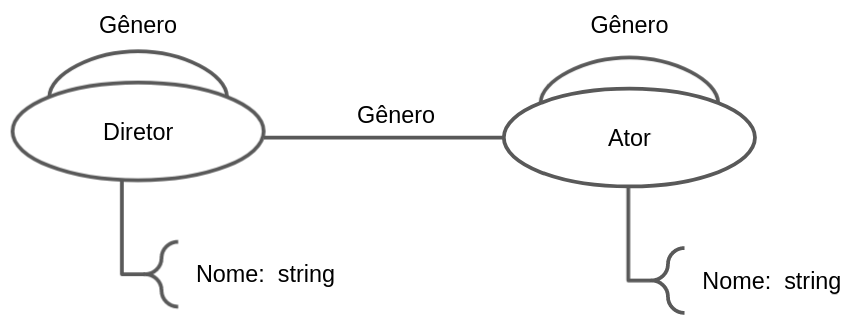

# Equipe `MC536 & Chill` - `Chill`
* `André Vila Nova Wagner da Costa` - `213081`
* `Cristiano Sampaio Pinheiro` - `256352`
* `George Gigilas Junior` - `216741`

## Modelo Lógico Combinado do Banco de Dados de Grafos
> 
> 

> 
> _Figura 1: Grafo do modelo lógico_
> 
> 

> 
> 
> 
> 

> 
> _Figura 2: Grafo da projeção com relação a participação das pessoas nas mídias_
> 
> 

> 
> 
> 
> 

> 
> _Figura 3: Grafo da projeção que liga atores e diretores com relação ao gênero das obras trabalhadas_
> 
> 

## Perguntas de Pesquisa/Análise Combinadas e Respectivas Análises

>
### Pergunta/Análise 1
> * Dado que uma pessoa X trabalhou com uma pessoa Y e uma pessoa Z, qual a chance de Y trabalhar com Z em um projeto futuro?
>   
>   * Para responder esta pergunta, podemos fazer uma análise da modalidade predição de links que, com base nas conexões do grafo da Figura 2, atribui um valor de 0 a 1 que indica a probabilidade de essas pessoas trabalharem juntas no futuro. 

### Pergunta/Análise 2
> * Como podemos mapear a flexibilidade de atores e diretores quanto ao gênero da obra trablhada?
>   
>   * Para responder esta pergunta, podemos fazer uma análise da modalidade centralidade com relação ao "betweenness" a partir do grafo da Figura 3. Com ele, podemos avaliar o valor do betweenness de cada pessoa e observar a formação de comunidades e das conexões entre elas. 

### Pergunta/Análise 3
> * Quanto a morte ou aposentadoria de um ator ou diretor impacta na produção de novos filmes e séries?
>   
>   * Para responder esta pergunta, podemos fazer uma análise da modalidade vulnerabilidade, a partir do grafo da Figura 2. Com ele, podemos analisar qual o impacto no grafo quando uma pessoa (ator ou diretor) é removida, a partir do índice visto em aula.
