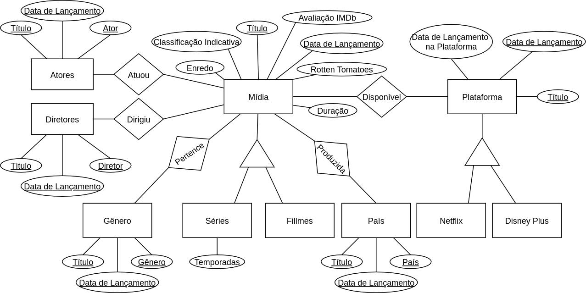
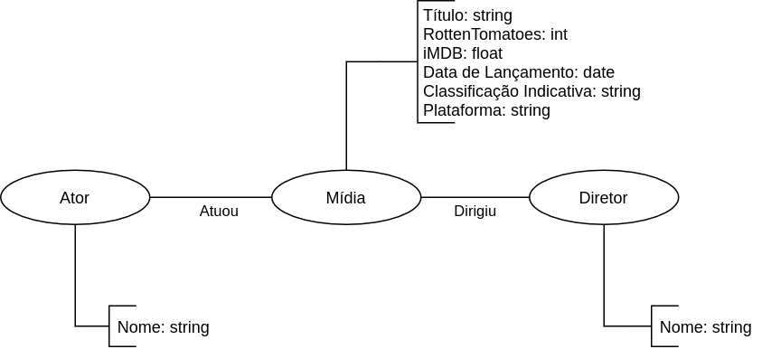

# Projeto `MC536-Chill`

# Equipe `MC536 & Chill` - `Chill`
* `André Vila Nova Wagner da Costa` - `213081`
* `Cristiano Sampaio Pinheiro` - `256352`
* `George Gigilas Junior` - `216741`

## Resumo do Projeto
> O acesso a filmes e séries foi muito facilitado com a popularização dos serviços de streaming. No entanto, o aumento no número dessas plataformas pode trazer dúvidas sobre quantas e quais assinar. Por isso, o grupo se propôs a avaliar o conteúdo disponível em quatro das principais plataformas de streaming: Netflix, Amazon Prime Video, Hulu e Disney Plus.

> Com isso, pode-se responder a perguntas como quais filmes possuem as melhores (ou piores) avaliações, quanto tempo uma obra demora para ser lançada em uma dessas plataformas, entre outras. No entanto, devido a uma maior disponibilidade de dados sobre o conteúdo da Netflix e da Disney+, o projeto apresentará uma maior quantidade de informações sobre estas plataformas.

## Slides da Apresentação
> [Slides](slides/previa.pdf)

## Modelo Conceitual Preliminar

> 

## Modelos Lógicos Preliminares

> Modelo lógico relacional
~~~
Filmes(_titulo_, _data de lançamento_, enredo, duração, plataforma,  classificação indicativa, avaliação IMDb, Rotten Tomatoes)
Séries(_título_, _data de lançamento_, enredo, temporadas, duração, plataforma, classificação indicativa, avaliação IMDb, Rotten Tomatoes)

Atores(_título_, _data de lançamento_,  _ator_)
Diretores(_título_, _data de lançamento_, _diretor_)

Gênero(_título_, _data de lançamento_, _gênero_)
País(_título_, _data de lançamento_, _país_)

Netflix(_título_, _data de lançamento_,  data de lançamento na plataforma)
Disney Plus(_título_, _data de lançamento_, data de lançamento na plataforma)
~~~

> Modelo de grafos de propriedades

## Dataset Preliminar a ser Publicado

título do arquivo/base | link | breve descrição
----- | ----- | -----
`Filmes` | [Link](data/interim/filmes.csv) | `Arquivo contendo dados sobre filmes`
`Séries` | [Link](data/interim/series.csv) | `Arquivo contendo dados sobre séries`
`Netflix` | [Link](data/interim/netflix.csv) | `Arquivo contendo data de lançamento para filmes e séries da Netflix`
`DisneyPlus` | [Link](data/interim/disneyplus.csv) | `Arquivo contendo data de lançamento para filmes e séries da Disney+`
`Atores` | [Link](data/interim/atores.csv) | `Arquivo contendo atores e filmes/séries em que trabalharam`
`Diretores` | [Link](data/interim/diretores.csv) | `Arquivo contendo diretores e filmes/séries em que trabalharam`
`Gêneros` | [Link](data/interim/generos.csv) | `Arquivo contendo filmes/séries e seus respectivos gêneros`
`Países` | [Link](data/interim/paises.csv) | `Arquivo contendo filmes/séries e seus respectivos países de produção`

## Bases de Dados

título da base | link | breve descrição
----- | ----- | -----
`TV shows on Netflix, Prime Video, Hulu and Disney+` | [Link](https://www.kaggle.com/ruchi798/tv-shows-on-netflix-prime-video-hulu-and-disney) | `Base de dados para séries`
`Movies on Netflix, Prime Video, Hulu and Disney+` | [Link](https://www.kaggle.com/ruchi798/movies-on-netflix-prime-video-hulu-and-disney) | `Base de dados para filmes`
`Disney Plus Movies and TV Shows` | [Link](https://www.kaggle.com/unanimad/disney-plus-shows) | `Base de dados para filmes e séries da Disney+`
`Netflix Movies and TV Shows` | [Link](https://www.kaggle.com/shivamb/netflix-shows) | `Base de dados para filmes e séries da Netflix`
`IMDb` | [Link](https://www.imdb.com/) | `Base de dados para filmes e séries em geral`

## Operações realizadas para a construção do dataset

> [Link para o arquivo do notebook](notebooks/DatasetBuilder.ipynb) que executa as operações de construção do dataset:
* Extração de dados dos datasets encontrados.
* Transformação dos atributos de gênero, país, atores e diretores para comporem outras tabelas.
* Tratamento de dados para remoção de filmes/séries repetidos entre os datasets encontrados.
* Integração de dados dos datasets encontrados.

## Perguntas de Pesquisa/Análise Combinadas e Respectivas Análises

### Pergunta/Análise 1
> * Pergunta 1
>   
>   * Explicação sucinta da análise que será feita ou conjunto de queries que
>     responde à pergunta.

### Pergunta/Análise 2
> * Pergunta 2
>   
>   * Explicação sucinta da análise que será feita ou conjunto de queries que
>     responde à pergunta.

### Pergunta/Análise 3
> * Pergunta 3
>   
>   * Explicação sucinta da análise que será feita ou conjunto de queries que
>     responde à pergunta.

> `Coloque um link para o arquivo do notebook que executa o conjunto de queries.`
